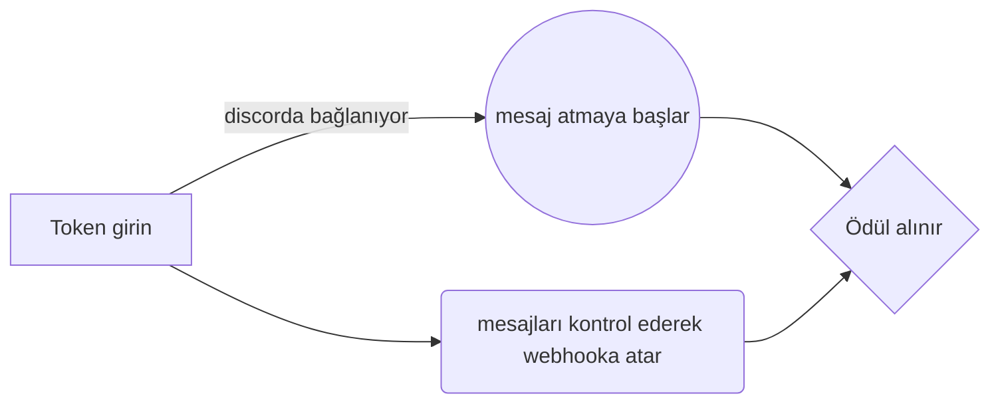

# Valaccount-oto-sender

Bu bot Atillanoxy tarafından hazırlanıp lisanslanmıştır lisansaltı kullanımı yasaktır. 
>1- Öncelikle bilgisayarınıza kodu indirin [Burdan indiriniz.](https://codeload.github.com/atillanoxy/valaccount-oto-sender/zip/refs/heads/main)
2- Kodu winrar veya benzeri bir programla rar'dan çıkartınız
3- Setup.bat dosyasını Çalıştırınız (Node.js'i kurar ardındından modülleri yükler)
4- Start.bat dosyasını çalıştırınız
5-Lisans anahtarınızı giriniz. Lisans anahtarınız yoksa burdan temin edebilirsiniz [Telegram.](https://t.me/quillone)
6- 2 tuşuna basarak ayarlar menüsüne girin. Ayaları kendinize göre dolduruktan sonra her şey hazır.
7- Ana menüye gelin 1 tuşuna basarak botu çalıştırınız.

## ♥Atillanoxy ♥

Atillanoxy türk uyruklu yazılımcıdıt. Node.js Python PHP JAVA C C# C++ dillerini bilmektedir. Uygun fiyata sizler için proje hazırlayabilir

[ATİLLANOXY -TELEGRAM](https://t.me/quillone/):

> Bu linkten diğer projelerime göz atabilirsiniz [Tıkla](https://github.com/atillanoxy):

